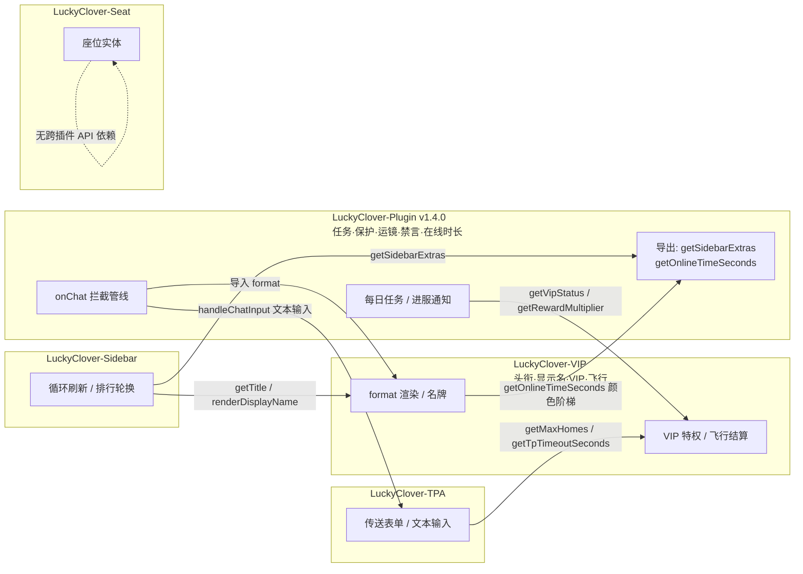

# LuckyClover 插件拆分方案 v2

> 状态：**已实施完成并通过实机验收**（5 插件加载正常、跨插件 API 全连通、游戏内功能测试全部通过） · 基线：主插件 v1.3.0 · 结果：主插件 v1.4.0 + 4 个新插件 v1.0.0
> 仓库：`E:\Code\LuckyClover-Mod` · 测试服：`D:\Bedrock-server`

## 1. 拆分总览

在 v1 方案（头衔 + 侧边栏两拆）基础上调整：**VIP 并入头衔插件，插件就叫 `LuckyClover-VIP`**；传送（TPA）与椅子（Seat）也独立拆出；侧边栏插件对外导出管理接口，配合后续网页管理面板。

| 插件 | 去向 | 职责 |
|---|---|---|
| **LuckyClover-VIP**（新） | 主插件拆出 | 头衔 + 显示名字 + VIP 等级特权 + 飞行（VIP 飞行与购买飞行整体跟随，见决策 1） |
| **LuckyClover-TPA**（新） | 主插件拆出 | TPA / Home / Warp / Back 传送系统 + 聊天文本输入交互 |
| **LuckyClover-Seat**（新） | 主插件拆出 | 右键台阶/楼梯坐下，管理 `luckyclover:seat` 实体（与已有 Seat-BP 行为包配对） |
| **LuckyClover-Sidebar**（新） | 主插件拆出 | 侧边栏循环刷新、TPS 采样、排行页轮换 + 管理导出 |
| **LuckyClover-Plugin**（v1.4.0） | 保留瘦身 | 每日任务、主城保护、电影运镜、禁言、在线时长、主菜单、跨服、进服通知、聊天拦截管线（onChat 唯一属主） |

**决策 1 · 飞行跟 VIP 走**：VIP 每日飞行与购买飞行共用同一套结算循环（`settleVipFlightUsage` / `settlePurchasedFlightUsage`）和 `mayfly` 能力控制，拆开会把一个循环劈成两半。因此 `/fly` 购买飞行、`vips.json`、`flight.json` 一并归入 LuckyClover-VIP。购买飞行只依赖 LSE 内置 `money` API，独立成立。若要改，只需把 `setPlayerMayfly` 反向导出给主插件。

**决策 2 · onChat 单一属主**：聊天拦截管线（传送文本输入 → 禁言 → override 格式化 → QQ 桥接 → 广播）整体留在主插件。LLSE 多插件监听 `onChat` 的 `return false` 语义不可控，两个插件抢同一事件会漏拦。主插件在管线中按需调用 TPA 与 VIP 的导出函数。

## 2. 架构与依赖

箭头方向 = **导入方向**（谁需要谁）。所有跨插件调用走 LSE 的 `ll.export` / `ll.imports`，均为 lazy 解析（调用时 `hasExported` 探测并缓存），无加载顺序要求。

要点：

- **双向 lazy 导入**：主插件需要 VIP 的 `format`，VIP 的名字颜色阶梯又依赖主插件的在线时长数据——互为导入方，全部在调用时解析，任何安装顺序都不死锁。
- **Seat 完全独立**：只依赖行为包 `LuckyClover-Seat-BP` 与 LSE API。
- **Sidebar 是叶子**：只出不进，缺任何数据源都降级显示。

## 3. 运行时 API 契约

插件之间协作用的导出（引擎内函数直调，参数/返回值可传对象）。namespace 与插件目录名对应。

### LuckyCloverVIP

| 函数 | 签名 | 调用方与场景 |
|---|---|---|
| `format` | `(template, player, msg) => string`；`template` 传 `null` 时使用本插件 `chatFormat` | 主插件 onChat override 广播、名牌 rename |
| `refreshNametag` | `(player) => void` | 外部触发后刷新名牌（VIP/显示名变更本插件自刷新） |
| `getTitle` | `(xuid) => string` | 侧边栏 `{sidebarTitle}` |
| `renderDisplayName` | `(player) => string` | 侧边栏 `{playerName}`（显示名 + 颜色终态） |
| `getVipStatus` | `(player) => {isVip, level, display, expireAt}` | 主插件进服通知的 VIP 横幅 |
| `getRewardMultiplier` | `(player, key, fallback) => number` | 主插件每日任务奖励倍率 |
| `getMaxHomes` | `(player, baseMax) => number` | TPA 的 Home 数量上限（`baseMax` 由 TPA 传入，缺省 3） |
| `getTpTimeoutSeconds` | `(player, baseSeconds) => number` | TPA 的请求有效期（`baseSeconds` 由 TPA 传入，缺省 60） |

### LuckyCloverTPA

| 函数 | 签名 | 调用方与场景 |
|---|---|---|
| `handleChatInput` | `(player, msg) => boolean` | 主插件 onChat 首行调用；`true` = 消息已被文本输入框消费，直接拦截 |

### LuckyCloverCore（主插件）

| 函数 | 签名 | 调用方与场景 |
|---|---|---|
| `getSidebarExtras` | `(player) => object` | 侧边栏 `{dailyTask*}`、`{onlineTime}`、`{topOnline1..10}` |
| `getOnlineTimeColor` | `(player) => string` | VIP 的在线时长名字颜色阶梯（缺插件时返回空串） |

**降级策略**：所有导入点 try/catch + null 缓存。缺 VIP 插件 → 聊天退化为 `{name}: {msg}`、`{vip}`/`{title}` 为空、名字不上色；缺 TPA 插件 → onChat 跳过文本输入检查；缺主插件 → VIP 颜色阶梯与侧边栏任务占位符显示为 `—`/空。任何一侧缺失都不抛异常、服务器正常启动，并在 `onServerStarted` 输出一行连通自检日志（GMLIB-Activator 模式）。

## 4. 管理接口规范（网页管理面板预留）

后续网页管理面板的形态：**LuckyClover-Panel 插件**（内嵌 HTTP 服务）作为桥梁，把下面的导出映射成 REST 接口，网页前端只与 Panel 通信。因此现在每个插件都要实现统一的「管理四件套」。

**序列化边界约定**：运行时协作 API（第 3 节）传对象；**管理 API 一律 JSON 字符串进出**（入参 string，返回 string），这样 Panel 可以直接把 HTTP body 透传给 `ll.imports`，无需在引擎边界处理对象克隆。

### 标准四件套（每个插件都实现）

| 函数 | 签名 | 说明 |
|---|---|---|
| `mgmtGetConfig` | `() => string(JSON)` | 返回当前生效的完整配置 |
| `mgmtSetConfig` | `(json) => string(JSON {ok, error?})` | 校验 + 写盘 + 热应用（不重启生效） |
| `mgmtReload` | `() => string(JSON {ok})` | 从磁盘重读配置（面板直接改文件后调用） |
| `mgmtStatus` | `() => string(JSON)` | 运行时状态摘要（开关、循环是否在跑、数据量等） |

### 各插件特有管理接口

**LuckyCloverVIP**（`LuckyCloverVIP`）

- `mgmtListVips()` — 有效 VIP 列表
- `mgmtSetVip(name, level, days)` / `mgmtRemoveVip(name)`
- `mgmtSetTitle(name, title)` / `mgmtClearTitle(name)`
- `mgmtSetDisplayName(name, text)` / `mgmtClearDisplayName(name)`
- `mgmtGetFlight(name)` — VIP 与购买飞行余量

**LuckyCloverTPA**（`LuckyCloverTPA`）

- `mgmtListHomes(name)`
- `mgmtListWarps()` / `mgmtDeleteWarp(name)` — 面板代删公共传送点
- `mgmtClearHomes(name)`
- `mgmtGetPendingRequests()` — 当前挂起的 TPA 请求

**LuckyCloverSeat**（`LuckyCloverSeat`）

- `mgmtGetSessionCount()` — 在坐人数
- `mgmtSetDefaultEnabled(bool)`
- `mgmtCleanupAll()` — 清理全部座位实体

**LuckyCloverSidebar**（`LuckyCloverSidebar`）

- `mgmtGetMetrics()` — tps / mspt / 在线数 / 当前页
- `mgmtRenderPreview(name)` — 返回该玩家侧边栏最终行数组（面板所见即所得）
- `mgmtSetPage("main" | "ranking")` — 强制翻页

**LuckyCloverCore**（主插件同样纳入面板）

- 标准四件套
- `mgmtListDailyTasks()` / `mgmtGetOnlineTop(n)`
- `mgmtMuteList()` / `mgmtUnmute(name)`
- `mgmtHubRegions()`

## 5. 占位符归属

| 占位符 | 归属 | 说明 |
|---|---|---|
| `{title}` `{rawTitle}` | VIP | titleWrapper 包装逻辑 |
| `{vip}` `{rawVip}` `{vipLevel}` `{isVip}` | VIP | 与头衔同插件，不再跨插件 |
| `{name}` `{displayName}` `{customName}` | VIP | 数据 + VIP 逐字彩名 + 在线时长颜色阶梯（阶梯数据来自主插件导出） |
| `{device}` `{ping}` `{msg}` | VIP | LSE 玩家 API，自包含 |
| `{sidebarTitle}` `{playerName}` | Sidebar ← 导入 VIP | |
| `{serverName}` `{onlinePlayers}` `{tps}` `{mspt}` `{time}` 系 | Sidebar 自算 | |
| `{money}` | Sidebar | LSE 内置 `money` API |
| `{dailyTask*}` `{onlineTime}` `{topOnline1-10}` | Sidebar ← 导入 Core | 数据源留在主插件 |

## 6. 代码搬迁清单

行号基于当前 v1.3.0 的 `LuckyClover-Plugin.js`（6102 行）。

### → LuckyClover-VIP

| 内容 | 位置 |
|---|---|
| 数据路径与存储：`titles.json` `customnames.json` `vips.json` `flight.json`（4 个 store） | 10, 16–18, 272–289 |
| config 键：`chatFormat` `nametagFormat` `titleWrapper` `emptyTitleFallback` `vip` `fly` | 60–76, 83–113, 307–323, 487–543 |
| 头衔/显示名存取 + 渲染：`getTitleKey` ~ `clearStoredCustomName`、`renderTitlePrefix` `renderRawTitle` `applyColorCodes` `formatText` | 2659–2690, 2977–3033 |
| 名牌：`applyPlayerTitle` `applyAllOnlinePlayers` | 3111–3123 |
| VIP 全套：等级/颜色/倍率/飞行结算（`getVipEntry` ~ `applyVipFlightState` 等） | 637–1375 |
| 飞行购买：`buyPurchasedFlightHour` `takePlayerMoney` `setPlayerMayfly` 等 | 1005–1310 |
| 命令：`settitle` `cleartitle` `setname` `clearname` `vip` `fly` 六个注册 | 4482–4710 |
| 工具：`formatPlayerDevice` `getPlayerLatency` `formatPlayerName` + VIP 名字颜色 | 2738–2801, 760–813 |

### → LuckyClover-TPA

| 内容 | 位置 |
|---|---|
| 数据：`teleports.json` store、`pendingTextInputs` 状态 | 15, 277–280, 36 |
| config 键：`teleport` | 213–224, 609–612 |
| 传送全部函数：Home/Warp/Back/TPA 表单与请求、文本输入交互（`getTeleportCommandName` ~ `handleBackCommand`） | 3296–4062 |
| 命令注册：`tpa` `tpaccept` `tpdeny` `tpacancel` `back` `home` `warp` | 5447–5483 |

### → LuckyClover-Seat

| 内容 | 位置 |
|---|---|
| 数据：`seat_prefs.json`、`seatSessions`、`SEAT_*` 常量 | 12, 32–34, 274 |
| config 键：`seatFeature` | 148–151, 604–607 |
| 座椅函数：`getSeatKey` ~ `scheduleSeatCleanupLoop` | 2174–2406 |
| 命令：`seat` 注册 | 4765–4816 |
| 事件：`onSneak` `onJump` `onChangeDim` 中的 `stopSeat`、`onLeft`/`onRespawn` 中的 seat 部分 | 5537–5554, 5529, 5542 |

### → LuckyClover-Sidebar

| 内容 | 位置 |
|---|---|
| 常量与状态：`SIDEBAR_SORT_DESC`、`sidebarMetrics/Page/Loop` | 23, 38–45 |
| config 键：`sidebar`（含 rankingTitle/rankingLines） | 194–230, 441–468 |
| `getSidebarConfig` `getSidebarLatency` `getCurrentTimeParts` | 544–548, 2713, 2704 |
| `buildSidebarLines` ~ `scheduleSidebarLoop`、`updateRankingSidebar` `updateAllRankingSidebars` | 2802–2950, 3197–3217 |
| 事件：`onServerStarted → scheduleSidebarLoop`、`onJoin → 刷新侧边栏` | 5496, 5512–5520 |

### 主插件残留改造点（不是删除，是改为导入）

- `onChat`（5556–5577）：首行加 `tpaApi.handleChatInput(...)`；`formatText(...)` → `vipApi.format(...)`，拿不到用内置降级格式
- 进服通知（3069–3109）：VIP 判断 → `vipApi.getVipStatus(...)`
- 每日任务领奖（1677, 1725 附近）：奖励倍率 → `vipApi.getRewardMultiplier(...)`
- 删除 4+2 个命令注册、sidebar/title/vip/teleport/seat 全部搬迁代码
- README 同步删章节，版本号 → 1.4.0

## 7. 数据与配置迁移

### 数据文件

| 文件 | 新归属 | 迁移方式 |
|---|---|---|
| `titles.json` `customnames.json` `vips.json` `flight.json` | LuckyClover-VIP | 首启自动复制（新路径不存在 && 旧路径存在） |
| `teleports.json` | LuckyClover-TPA | 同上 |
| `seat_prefs.json` | LuckyClover-Seat | 同上 |
| `daily_tasks.json` `online_time.json` `mutes.json` `cinematics.json` | 留在主插件 | 不动 |

**⚠️ sb3_LuckyCloverMC2QQ（已按用户指示暂不处理）**：`index.js:48` 与 config `LuckyCloverTitle.file` 仍指向 `plugins/LuckyClover-Plugin/titles.json`。迁移采用"复制不移动"，且 `/settitle` 之后只写新路径 —— 未改路径前，QQ 消息里的头衔会停留在迁移时的旧快照。后续若要恢复该功能，把路径改为 `plugins/LuckyClover-VIP/titles.json` 即可。

### 配置文件

| 主插件 config.json 旧键 | 新归属 |
|---|---|
| `chatFormat` `nametagFormat` `titleWrapper` `emptyTitleFallback` `vip` `fly` | LuckyClover-VIP |
| `teleport` | LuckyClover-TPA |
| `seatFeature` | LuckyClover-Seat |
| `sidebar` | LuckyClover-Sidebar |
| 其余（`chatFormatMode` `chatBridge` `joinNotify` `dailyTasks` `hubProtection` `cinematic` `mute` `nameColor` `transfer` `mainMenu`…） | 留在主插件 |

迁移方式：新插件首启发现自己的 `config.json` 不存在时，读主插件 config.json 抽取对应键；抽不到用内置默认值（默认值 = 当前值，行为不变）。

**版本与部署矩阵**：主插件 1.3.0 → 1.4.0（破坏性重构），4 个新插件 1.0.0。三者（核心 + VIP + TPA，视启用功能而 Sidebar/Seat 可选）**必须同版本一起部署**，README 写明。

## 8. 事件与命令归属

### 事件

| 事件 | 属主 | 说明 |
|---|---|---|
| `onChat` | **仅主插件** | 返回值语义事件，单属主；内部调 TPA 文本输入 + VIP format |
| `onJoin` | 各插件各挂各的 | VIP：applyNametag；Sidebar：刷新；Core：joinNotify + 在线会话 |
| `onLeft` | 各插件各挂各的 | TPA：清请求/输入框；Seat：停座位；VIP：结算飞行；Core：在线时长 + 运镜 |
| `onRespawn` | VIP + Seat | VIP：重挂飞行；Seat：停座位 |
| `onSneak` `onJump` `onChangeDim` | Seat | 只含座位逻辑 |
| `onServerStarted` | 各插件各挂各的 | VIP：applyAll + 连通自检；Sidebar：起循环；Core：任务循环等 |

> 需实机确认一次：LLSE 中多个插件对同一无返回值事件（onJoin 等）的监听互不覆盖。

### 命令

| 插件 | 命令 |
|---|---|
| LuckyClover-VIP | `/settitle` `/cleartitle` `/setname` `/clearname` `/vip` `/fly` |
| LuckyClover-TPA | `/tpa` `/tpaccept` `/tpdeny` `/tpacancel` `/back` `/home` `/warp` |
| LuckyClover-Seat | `/seat` |
| LuckyClover-Plugin | `/daily` `/menu` `/hubprotect` `/cinematic` `/mute` `/unmute` `/mutelist` `/muteinfo` `/serverhub` |

主菜单（DogeUI `/menu`）按钮仍执行命令字符串，各命令由对应插件注册——全部安装时无感。

## 9. 实施阶段

| 阶段 | 内容 | 产出 |
|---|---|---|
| 1 | 建 `LuckyClover-VIP/`：manifest + 搬迁移代码 + 8 个运行时导出 + 4 件套 mgmt + 数据/配置自动迁移 | 独立可加载 |
| 2 | 主插件瘦身接线：删搬迁代码，`onChat` / 进服通知 / 每日奖励改为导入，版本 1.4.0 | 主插件 v1.4.0 |
| 3 | 建 `LuckyClover-TPA/`：传送 + 文本输入导出，导入 VIP 的 Home 上限/超时 | 独立可加载 |
| 4 | 建 `LuckyClover-Seat/`（与 Seat-BP 配对）+ `LuckyClover-Sidebar/`（三路导入 + mgmt 特有接口） | 两个独立可加载 |
| 5 | sb3 路径更新；五个 README 重写（主插件删章节 + 部署矩阵） | 文档一致 |
| 6 | 验证（见第 11 节） | 验收通过 |

## 10. 风险与坑

1. **ll.export 时机**：导出放各插件模块顶层，消费方 lazy 缓存；`onServerStarted` 做连通自检日志。
2. **命令双注册**：阶段 2 删不干净会同名冲突，按第 6 节清单逐一核对。
3. **`player.rename` 唯一 owner**：拆后只有 VIP 插件 rename，其他插件不得再改名牌。
4. **sb3 静默失效**：titles.json 路径必须同步改（第 7 节）。
5. **onChat 不能拆**：任何后续改动都不得让第二个插件监听 onChat。
6. **双向导入**：Core ↔ VIP 都用 lazy 解析，禁止在模块顶层互相 `ll.imports`。
7. **Seat 与 Seat-BP 命名**：目录 `LuckyClover-Seat`（脚本）与既有 `LuckyClover-Seat-BP`（行为包）并存，部署时注意区分。
8. **跨插件同事件双属主（评审重点，需实机验证）**：`onUseItemOn`（Seat 坐下 + 主插件主城保护）、`onMobDie`（TPA 记死亡点 + 主插件击杀任务）各自由两个插件注册监听。LLSE 对"多插件监听同一事件 + `return false` 短路"的实际语义未验证——若只保留首个注册者，双属主之一会静默失效。部署第一晚务必各测一遍：保护区内右键台阶、玩家死亡后 `/back`、击杀僵尸的每日任务进度。

## 11. 验收清单

- [ ] `node --check` 通过五个 JS 文件语法校验
- [ ] 只装主插件（无 VIP/TPA）：服务器正常启动，聊天降级格式，mute 正常
- [ ] 三插件齐装：`/settitle` 后聊天前缀、名牌、侧边栏 `{sidebarTitle}` 三处同时生效
- [ ] `/setname` 后聊天与侧边栏 `{playerName}` 同步变化；`/vip set` 后逐字彩名立即刷新
- [ ] `/vip` 面板、`/vip fly`、`/fly` 购买与扣费、每日时长结算正常
- [ ] `/tpa` `/home` `/warp` `/back` 全部表单可用；Home 上限与超时时间跟随 VIP 等级
- [ ] 传送文本输入（改 Home 名等）在 onChat 管线中正常拦截
- [ ] 右键台阶坐下 / 起身 / 禁言期间等边界下座位实体清理正常
- [ ] 侧边栏每日任务进度、在线时长、TOP10、页面轮换正常；缺数据源时降级不报错
- [ ] 首启迁移：6 个数据文件与 4 组配置键完整迁移；sb3 改路径后 QQ 头衔正常
- [ ] 管理接口：用控制台脚本依次调用 5 个插件的四件套，返回合法 JSON
- [ ] 逐个禁用插件，服务器均可正常启动且无未捕获异常
